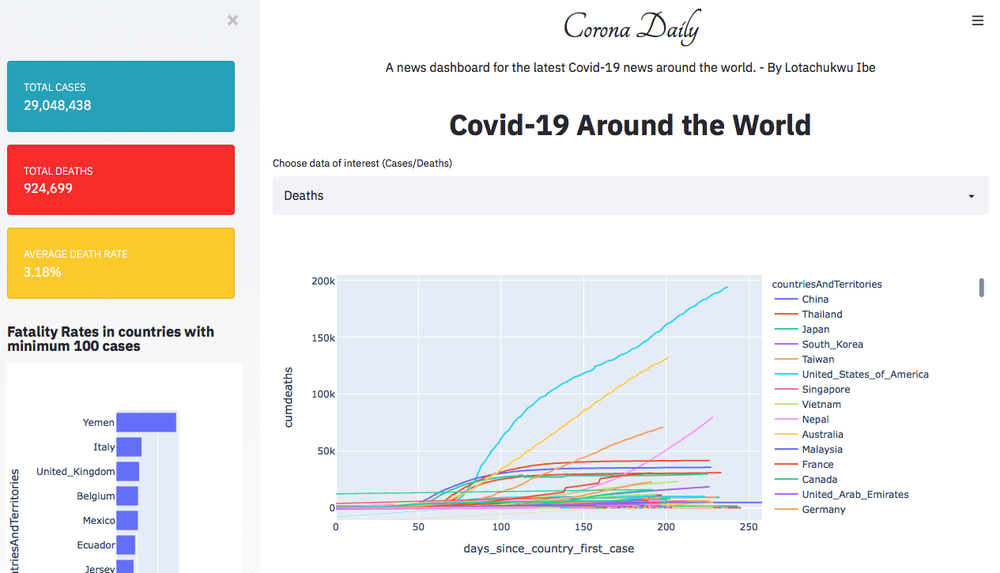
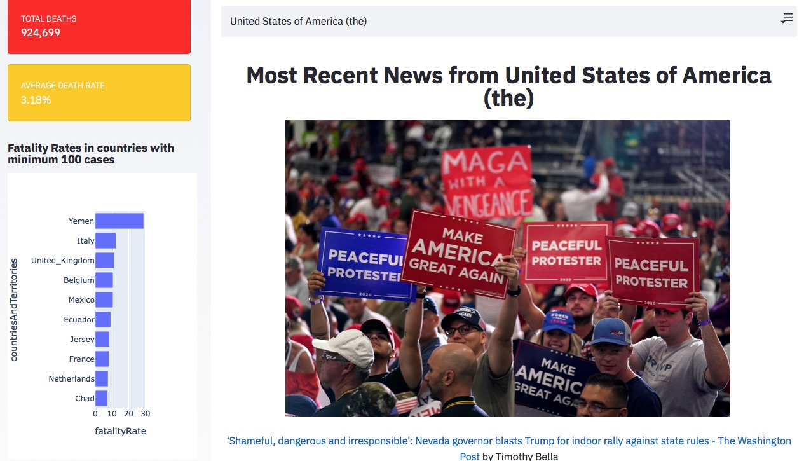

A web app for reporting the latest news on corona virus around the globe - [*Covid Daily*](https://secure-sierra-43846.herokuapp.com)

With so much news being reported on the Corona virus pandemic, it has become quite a task to get understand the current state of the virus around the world. This project attempts to solve that by building an international news dashboard to report the latest on news on Covid-19

<h2> Data </h2>
The data used in this project is from <a href= "https://opendata.ecdc.europa.eu/covid19/casedistribution/csv"> European Centre for Disease Control (CDC)</a>, an open data source for the latest data on Covid-19 and <a href= "https://newsapi.org/"> News Api </a> to access leading news articles around the world.

## Method  
- The news dashboard was created with Python & Streamlit with data from NewsApi and European CDC.  
- I performed sentiment analysis on:
 - the data using a custom sentiment analyzer from Textblob. 
 - the news outlets as well as some of the most positive and negative news related to Coronavirus.  

 View the dashboard [**here**](https://secure-sierra-43846.herokuapp.com)
 
## Results 
 
 <a href="https://secure-sierra-43846.herokuapp.com">   
 
 

 <a href="https://secure-sierra-43846.herokuapp.com"> 
